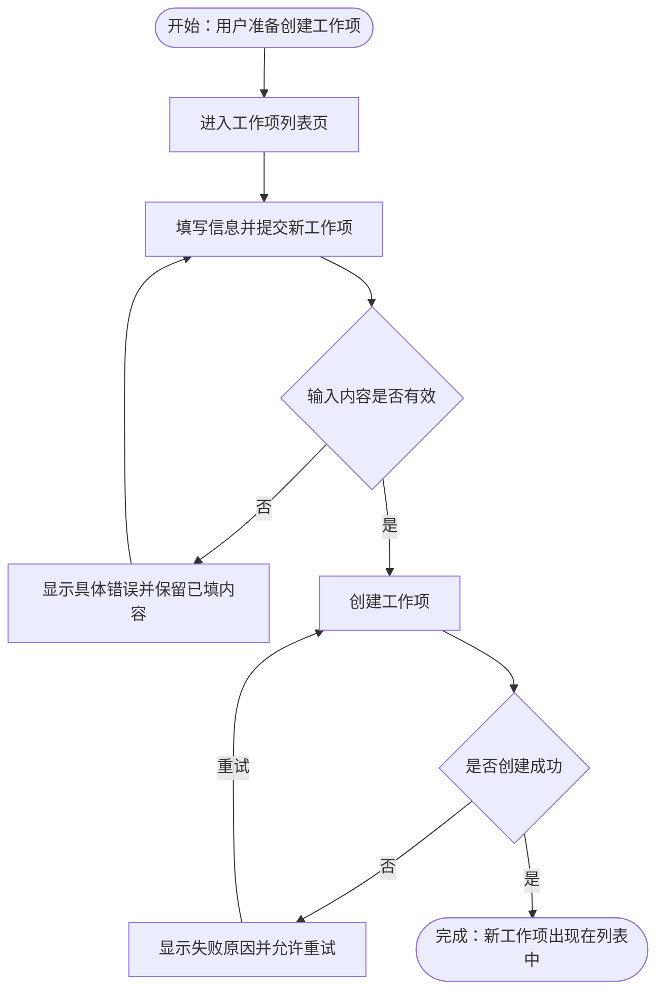

# 流程结构规范

规范版本：`2.0`

## 目标

流程规格用于让产品、设计、开发和测试人员直接理解：谁因为什么开始流程，依次做什么，在哪些条件下分支，失败后如何恢复，以及最终产生什么结果。

流程图和正文都使用自然中文表达产品行为。Mermaid 语法所需的节点名称只用于保证图可解析，不得把内部追踪代号显示给读者。

## 图示格式

每个用户流程和业务流程使用 Mermaid `flowchart TD` 表达。流程图说明产品行为、分支和结果，不替代图外的流程说明。

## Mermaid 契约

- 固定使用 `flowchart TD`，保持流程从上到下阅读。
- Mermaid 节点名称使用大驼峰英文且在当前图中唯一，例如 `CreateItem`、`InputValid`；节点名称不展示给读者。
- 节点显示文本全部使用清楚、自然的中文，不添加 `FLOW-*`、`PAGE-*`、`ACT-*`、`RULE-*`、`STATE-*` 或其他内部代号。
- 开始与结束节点使用圆角终止形 `([描述])`，行为或状态使用矩形节点，判断使用菱形节点 `{描述}`。
- 分支条件使用中文边标签 `-->|条件|`，每个判断的所有有效出口都必须明确。
- 循环、重试、取消、失败与恢复必须画出返回点或结束结果，不用图外文字代替关键路径。
- 一个图只表达一个可独立理解的流程。复杂子流程通过中文名称和 Markdown 链接引用，不把整个产品压入一张图。

## 必须表达

按实际流程覆盖：

- 触发条件、起点和完成结果；
- 执行角色及其关键行为；
- 涉及的页面、业务对象、规则和状态变化；
- 主路径、影响结果的重要分支和分支条件；
- 关键失败、取消、重试、回退或恢复路径；
- 跨页面跳转以及用户能够观察到的反馈。

不要为形式完整虚构不适用的异常分支，也不要把接口调用、数据库操作、组件方法等实现细节写成产品流程。

## 配套说明

Mermaid 图外至少用自然中文说明：

- **流程目的**：该流程为用户或业务解决什么问题；
- **参与者**：谁发起、谁处理、谁确认或只能查看；
- **触发与前置条件**：什么情况下开始，开始前必须具备什么；
- **涉及内容**：处理哪些业务对象，遵守哪些规则，在哪些页面完成；
- **完成结果**：成功后产生什么状态或可见结果；
- **异常恢复**：主要失败如何反馈，用户或系统如何继续；
- **验收结果**：如何从用户可观察行为判断流程正确完成。

页面、规则和其他流程使用中文名称与 Markdown 链接追踪。外部已有且必须保留的编号可以附带展示并解释，但不能代替中文名称。

## 阻塞条件

以下任一情况都会使流程规格不可通过：

- 缺少 Mermaid `flowchart TD`，或图无法解析；
- 节点名称不唯一或未使用大驼峰英文；
- 节点显示文本包含要求读者解码的内部代号；
- 第一次接触产品的读者无法从当前文件理解流程目的、参与者和完成结果；
- 主路径缺少明确起点、完成结果或关键步骤；
- 判断节点存在未说明的有效出口；
- 关键失败、取消或恢复路径断裂；
- 图外说明只列名称或链接，没有解释流程行为；
- 流程图与页面、对象状态、权限、共享规则或验收结果相互矛盾。
